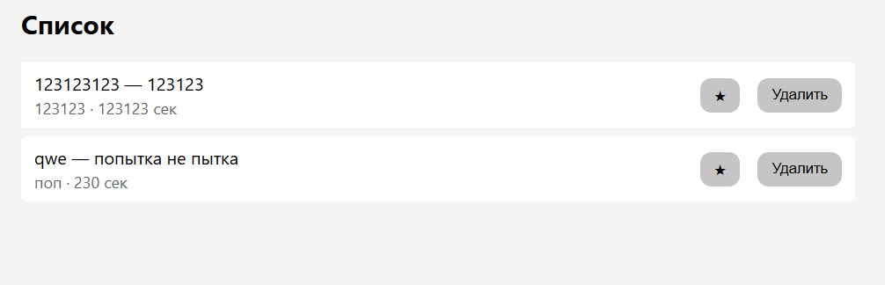
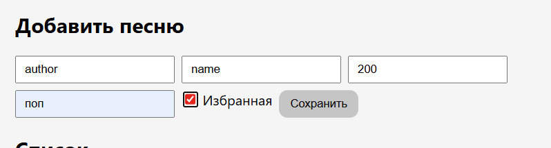
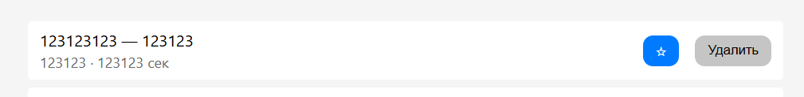

# Список любимой музыки 
### 🚀 Технологии: 
 - Backend: Express.js, Node.js
 - Frontend: HTML, CSS, JavaScript

## Разработчик: Ратасеп Матвей ЭФБО-06-24

## Описание проекта
Этот проект представляет собой простой список моей любимой музыки 🎶. 
В нем реализован простой интерфейс для отображения и управления списком музыкальных треков.

🔨 Базовая API включает в себя следующие функции:
- Просмотр списка любимой музыки
- Добавление нового трека в список
- Изменение информации о треке
- Удаление трека из списка
- Получение трека по id

📂 Проект структурирован следующим образом:
- Папка routers содержит маршруты для обработки HTTP-запросов.
- Папка controllers содержит контроллеры для управления логикой приложения.
- Папка middleware содержит промежуточный функционал для обработки запросов.

Middleware используется для логирования запросов и обработки ошибок.

Frontend часть проекта реализована с использованием HTML, CSS и JavaScript для создания удобного пользовательского интерфейса.
JavaScript используется для взаимодействия с API и динамического обновления содержимого страницы.

## 🖼️ Скриншоты с реализованным функционалом

1. Просмотр списка любимой музыки

2. Добавление нового трека в список

3. Добавление трека в избранное 

4. Удаление трека из списка

